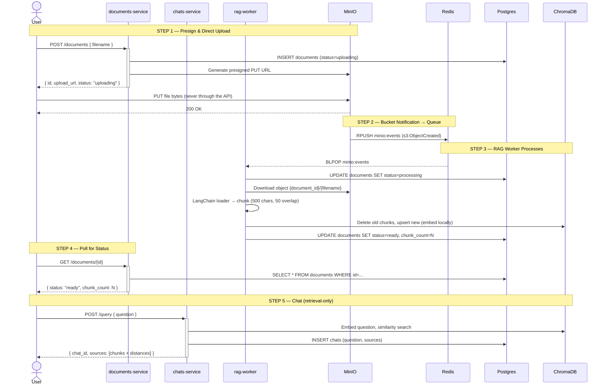

# CLAUDE.md

This file provides guidance to Claude Code (claude.ai/code) when working with code in this repository.

## What This Project Is

A fullstack hands-on RAG (Retrieval-Augmented Generation) data pipeline built as Python microservices. The core design principle is **separation of responsibilities**: the upload path never blocks on processing.



- File bytes never pass through the API services — clients upload straight to MinIO via presigned URLs.
- MinIO is configured (docker-compose.yml) to RPUSH put-events onto the Redis list `minio:events`; the worker BLPOPs it as a queue.
- Object keys are `<document_id>/<filename>`; the worker derives the document ID from the key to stamp status (`uploading → processing → ready|failed`) in Postgres.
- Embeddings use Chroma's default local embedding function (all-MiniLM-L6-v2) — no API keys. The worker writes and the chats service queries the same `documents` collection, so both must keep using the same embedding function.

## Layout

- `services/documents/` — async FastAPI (port 8001): creates document rows, returns presigned PUT URLs, exposes status. Owns the `documents` table (creates it on startup — start this service before the worker processes anything).
- `services/rag_worker/` — queue consumer: Redis event → fetch from MinIO → LangChain loaders (txt/md/pdf/html) → chunk → ChromaDB upsert → stamp status.
- `services/chats/` — FastAPI (port 8002): `POST /query` retrieval-only similarity search; logs exchanges in its own `chats` table.
- `simple-rag/` — earlier single-script version of the same pipeline (ingest + notebook for exploring ChromaDB). Kept for reference/learning.
- `docker-compose.yml` — infrastructure only: MinIO (9000/9001), Redis (6379), Postgres (5432), ChromaDB (8000). Services run locally in the venv.

## Architectural Rules

- Keep the upload path and the processing path in separate services — the upload handler must never block on chunking or embedding.
- The file in MinIO is the source of truth; ChromaDB holds only derived data. Reprocessing must be possible from MinIO alone (the worker deletes a document's old chunks before re-upserting).
- Pass references (bucket/object key, document ID) through the queue, not file contents.
- Each service has its own `requirements.txt`; for local dev they all install into the root `venv/`.

## Commands

```bash
# one-time setup
python3 -m venv venv
venv/bin/pip install -r services/documents/requirements.txt \
                     -r services/rag_worker/requirements.txt \
                     -r services/chats/requirements.txt

docker compose up -d          # infra: MinIO, Redis, Postgres, ChromaDB (+ bucket/event init)

# run the three services (separate terminals)
venv/bin/uvicorn services.documents.app:app --port 8001 --reload
venv/bin/uvicorn services.chats.app:app --port 8002 --reload
venv/bin/python -m services.rag_worker.worker

# end-to-end smoke test
curl -X POST localhost:8001/documents -H 'Content-Type: application/json' -d '{"filename": "doc.pdf"}'
curl -X PUT --upload-file doc.pdf "<upload_url from previous response>"
curl localhost:8001/documents/<id>          # poll until status=ready
curl -X POST localhost:8002/query -H 'Content-Type: application/json' -d '{"question": "..."}'
```

MinIO console: http://localhost:9001 (minioadmin/minioadmin).

### simple-rag (standalone learning script)

```bash
venv/bin/python simple-rag/ingest.py                       # ingest simple-rag/data/* into local chroma_db
venv/bin/python simple-rag/ingest.py --query "question"    # test similarity search
```

## Gotchas

- A moved venv is broken (scripts hard-code paths) — recreate instead of `mv`.
- MinIO's Redis `access` notification format wraps records inconsistently; `worker.event_records()` normalizes the shapes — don't assume `{"Records": [...]}`.
- ChromaDB returns metadata dicts with non-deterministic key order; sort keys when displaying.
- If the worker is down when an upload lands, the event waits in the Redis list (good). But if the worker crashes mid-event, that event is lost and the row stays `uploading` — re-upload to retrigger, or build reconciliation later.
