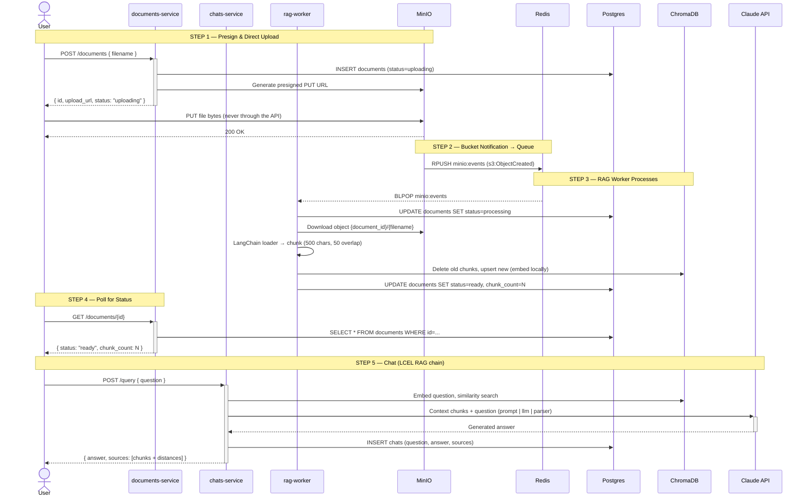

# RAG Data Pipeline

A fullstack hands-on RAG (Retrieval-Augmented Generation) data pipeline built as Python microservices. The core design principle is **separation of responsibilities**: the upload path never blocks on processing.

## Architecture



Key design points:

- File bytes never pass through the API services — clients upload straight to MinIO via presigned URLs.
- MinIO is configured (docker-compose.yml) to RPUSH put-events onto the Redis list `minio:events`; the worker BLPOPs it as a queue.
- Object keys are `<document_id>/<filename>`; the worker derives the document ID from the key to stamp status (`uploading → processing → ready|failed`) in Postgres.
- Embeddings use Chroma's default local embedding function (all-MiniLM-L6-v2) — no API key needed for ingestion. The worker writes and the chats service queries the same `documents` collection, so both must use the same embedding function (the chats service wraps it in a LangChain `Embeddings` adapter).
- The chats service composes retrieval + generation as one LCEL graph: `RunnableParallel(docs, question).assign(answer = context | prompt | ChatAnthropic | StrOutputParser)`.

## Layout

| Path | What it is |
|---|---|
| `services/documents/` | Async FastAPI (port 8001). Presigned upload slots, status tracking, and document management: download / reprocess / delete. Owns the `documents` table (creates it on startup). |
| `services/rag_worker/` | Queue consumer: Redis event → fetch from MinIO → LangChain loaders (txt/md/pdf/html) → chunk → ChromaDB upsert → stamp status. |
| `services/chats/` | FastAPI (port 8002). `POST /query` runs the LCEL RAG chain (retrieval + Claude answer); logs exchanges in its own `chats` table. Requires `ANTHROPIC_API_KEY`. |
| `ui/` | Single-file chat UI (vanilla JS, port 3000): drag-and-drop upload with live status badges, chat with answers + source chunks, per-document actions. |
| `simple-rag/` | Earlier single-script version of the same pipeline (ingest + notebook for exploring ChromaDB). Kept for reference/learning. |
| `docker-compose.yml` | Infrastructure only: MinIO (9000/9001), Redis (6379), Postgres (5432), ChromaDB (8000). Services run locally in the venv. |

## API

### documents-service (:8001)

| Method | Path | Purpose |
|---|---|---|
| POST | `/documents` | Create record (`status=uploading`), return presigned PUT URL |
| GET | `/documents` | List all documents with status |
| GET | `/documents/{id}` | Single document status |
| GET | `/documents/{id}/download` | Presigned GET URL for the original file |
| POST | `/documents/{id}/reprocess` | Re-enqueue chunking/embedding via the Redis queue |
| DELETE | `/documents/{id}` | Delete everywhere: chunks, MinIO object, DB row |

### chats-service (:8002)

| Method | Path | Purpose |
|---|---|---|
| POST | `/query` | RAG query: retrieve chunks, generate answer with Claude, log exchange |
| GET | `/chats` | Chat history (question, answer, sources) |

## Quickstart

```bash
make setup        # create venv + install all service dependencies
echo 'ANTHROPIC_API_KEY=sk-ant-...' > .env   # needed by the chats service
```

Everything at once:

```bash
make run          # infra + all three services + UI in one terminal (Ctrl-C stops all)
```

Or individually, for isolated logs and per-service restarts:

```bash
make infra        # start MinIO, Redis, Postgres, ChromaDB (+ bucket/event init)

# four terminals:
make documents    # :8001
make chats        # :8002 (reads .env automatically)
make worker       # queue consumer
make ui           # http://localhost:3000
```

`make help` lists all targets. MinIO console: http://localhost:9001 (minioadmin/minioadmin).

### Smoke test (no UI)

```bash
curl -X POST localhost:8001/documents -H 'Content-Type: application/json' -d '{"filename": "doc.pdf"}'
curl -X PUT --upload-file doc.pdf "<upload_url from previous response>"
curl localhost:8001/documents/<id>          # poll until status=ready
curl -X POST localhost:8002/query -H 'Content-Type: application/json' -d '{"question": "..."}'
```

### simple-rag (standalone learning script)

```bash
make ingest                  # ingest simple-rag/data/* into its local chroma_db
make query Q="your question" # similarity search against it
```
